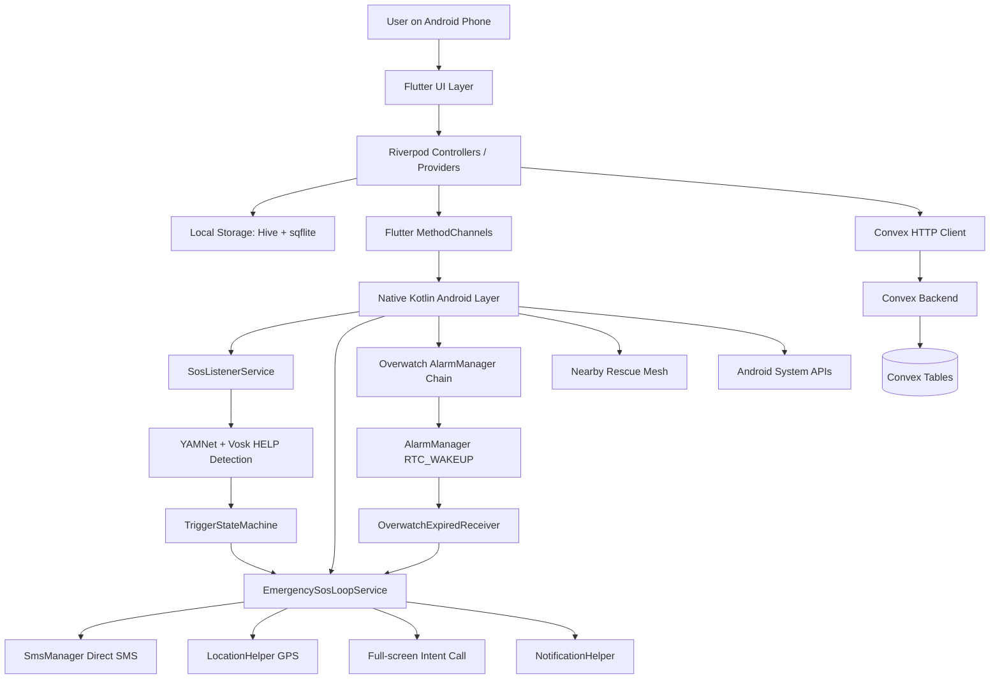
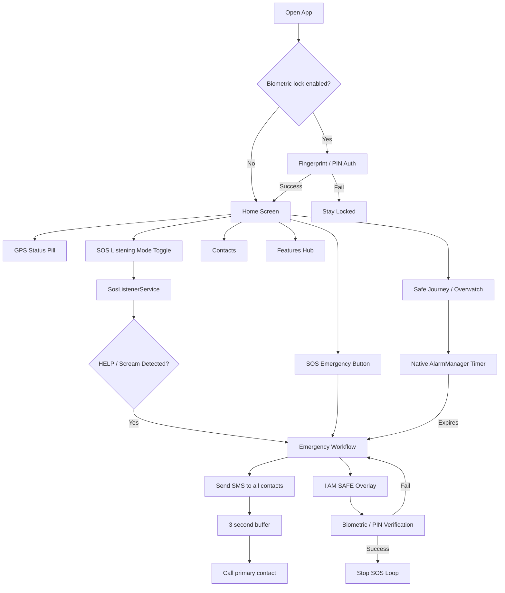
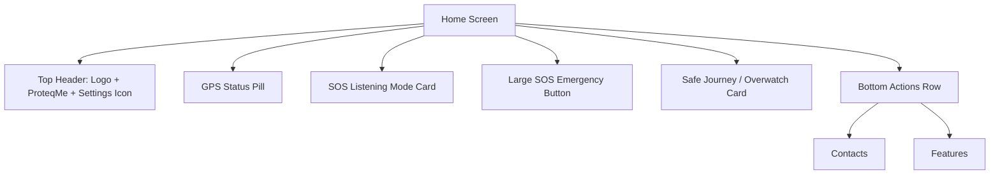
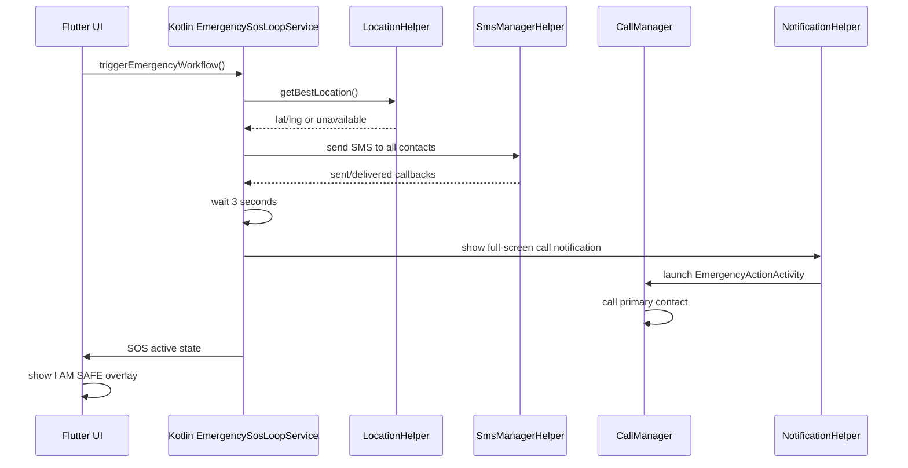
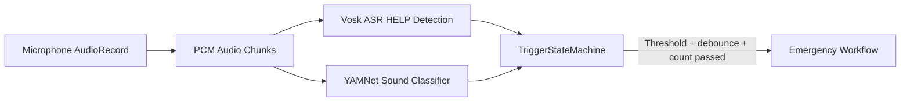
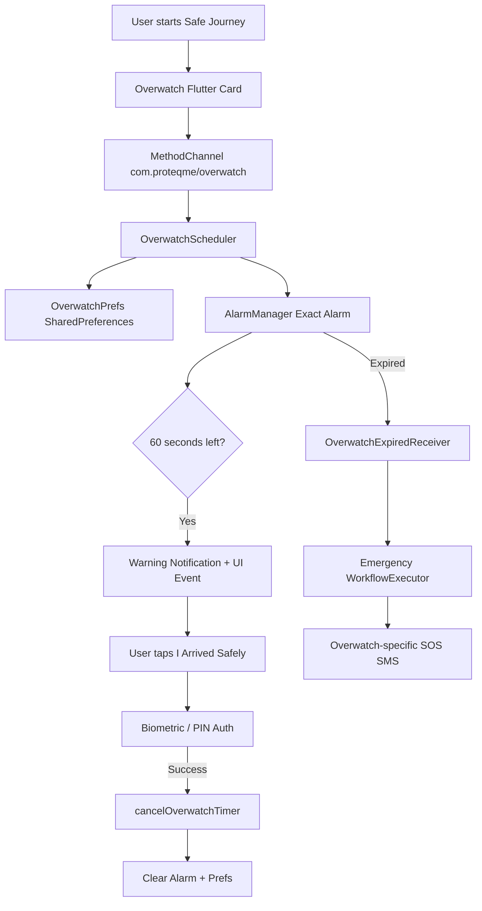
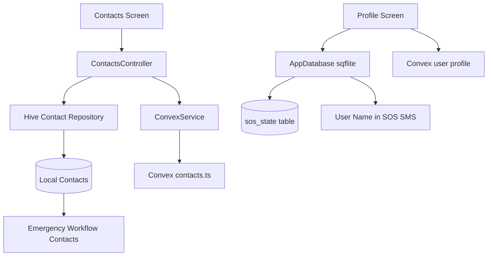
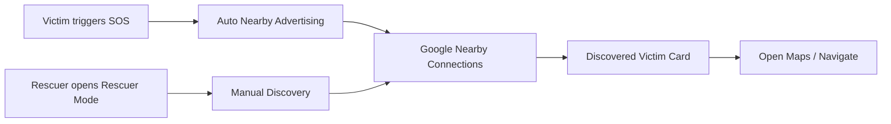
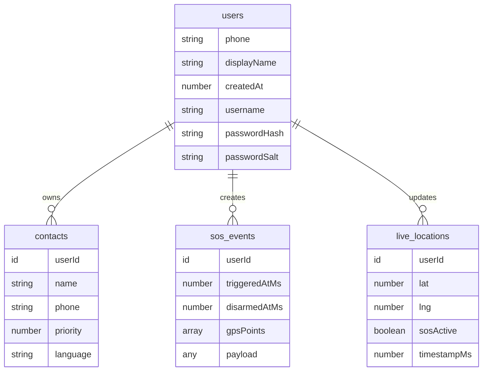
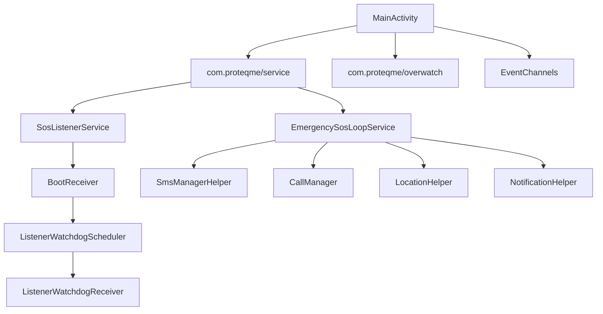

# ProteqMe Project Diagram

Deep architecture description of the ProteqMe Android safety app.

## Project Architecture

## Main Layers

ProteqMe is an Android-only Flutter safety app with a native Kotlin emergency engine.

The Flutter side handles UI, navigation, state, forms, permissions, contacts, profile, rescue screens, logs, and settings. Riverpod connects screens to controllers and repositories.

The Kotlin side handles anything that must survive background execution: voice detection, foreground services, SMS sending, calls, GPS lookup, watchdog restart, boot recovery, and Overwatch timer expiry.

Convex is the optional cloud backend for auth, contact sync, SOS event storage, and live location mirroring.

## User Flow

## Home Screen Layout

The home screen is designed around emergency-first hierarchy. The logo and settings are at the top, GPS state is shown immediately, listening mode is clearly visible, and the SOS button is the visual center. Manual trigger UI was removed so the emergency action is simpler.

## Emergency Workflow

The emergency loop prioritizes SMS first, then call. This is important because SMS can carry location, timestamp, user name, and emergency context before the phone starts dialing.

## Voice Detection Pipeline

Voice detection runs natively in `SosListenerService` as a foreground service. It uses microphone audio chunks, ASR HELP recognition, and YAMNet-style sound classification. The state machine prevents accidental triggers using debounce, trigger windows, and cooldowns.

## Overwatch / Safe Journey

Overwatch is the dead-man's switch. The timer is native, not just a Flutter timer, so it can still fire if the app is closed. It stores the end timestamp in preferences and re-arms after reboot.

## Contact + Profile Data Flow

Contacts are primarily local so emergency behavior works offline. Convex acts as sync and backup. The user display name is stored locally and used in SMS templates, then mirrored to Convex when available.

## Rescue Mode

Rescue mode is split into victim and rescuer roles. The victim device advertises automatically after SOS. Rescuers manually scan nearby and see victim location/details.

## Convex Backend

Convex stores cloud-side user profile, contacts, SOS events, and live location. The app still keeps emergency-critical data locally so it can operate during network loss.

## Native Android Components

The native layer exists because Android background limits make pure Flutter timers and background work unreliable. Foreground services, AlarmManager, receivers, and full-screen notifications are used for safety-critical paths.

## Key Design Principle

ProteqMe follows this split:

- Flutter: UI, state, forms, user flows, settings, local auth prompts.
- Kotlin: background-safe emergency execution.
- Local database: emergency-critical offline state.
- Convex: optional cloud backup, sync, and future remote escalation.
- Biometric/PIN: required for sensitive actions like disarming SOS, modifying contacts, and opening the app when lock is enabled.
