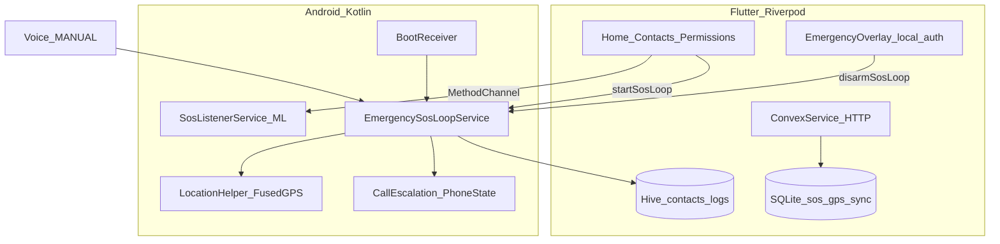

# ProteqMe — Project Skills & Technical Reference

Canonical guide for the **ProteqMe** Android emergency app (`com.proteqme`). Package name in Dart: `proteqme`.

| Identifier | Value |
|------------|--------|
| **Product name** | ProteqMe |
| **Android application ID** | `com.proteqme` |
| **Kotlin package** | `com.proteqme` |

---

## 1. Purpose

Offline-first, voice-activated personal safety for Sri Lanka:

- **On-device listening** (YAMNet + Vosk HELP) in a foreground service
- **Unbreakable SOS loop** when triggered: periodic carrier SMS with GPS, sequential calling with duration heuristics, boot resume
- **Biometric disarm** (“I AM SAFE”) via `local_auth`
- **Convex cloud vault** (optional): OTP login, contact sync, live family map, post-incident logs
- **Rescue mode** (optional): `nearby_connections` mesh when cellular is down

No Twilio or third-party telephony APIs — SMS and calls use the device SIM (`SmsManager`, `ACTION_CALL`).

---

## 2. Architecture



---

## 3. Implemented Features (vs roadmap)

| Feature | Status | Implementation |
|---------|--------|----------------|
| Continuous SOS SMS loop (5–7 min) | **Implemented** | `EmergencySosLoopService` + configurable interval (default 360s) |
| Sequential call escalation (40s rule) | **Implemented** | `CallEscalationManager` + `PhoneStateListener` |
| Boot resume | **Implemented** | `BootReceiver` + `SosLoopPrefs` |
| Biometric disarm | **Implemented** | `EmergencyOverlayScreen` + `local_auth` |
| GPS in SMS | **Implemented** | `LocationHelper` (Fused Location + last-known fallback) |
| EN / SI / TA SMS templates | **Implemented** | `SosMessageTemplates.kt` per contact `language` |
| Convex OTP + contact vault | **Implemented** | `convex/auth.ts`, `AuthScreen`, HTTP client |
| Live family map (online) | **Implemented** | `liveLocation.ts` + `LiveLocationService` during SOS |
| Rescue mesh (offline) | **Implemented** | `RescueModeService` + `nearby_connections` when no cell/Wi‑Fi |
| Voice HELP detection | **Implemented** | `SosListenerService` → starts SOS loop on trigger |
| Porcupine / Sinhala-Tamil wake words | **Not yet** | Future: custom models in `assets/ml/` |

---

## 4. Technology Stack

### Flutter (`pubspec.yaml`)

| Package | Role |
|---------|------|
| `flutter_riverpod` | UI state |
| `hive` / `hive_flutter` | Contacts + emergency event logs |
| `sqflite` | SOS state, GPS trail, `pending_sync`, auth session |
| `geolocator` | Flutter-side location (permissions + fresh fix) |
| `permission_handler` | Runtime permissions incl. background location |
| `local_auth` | Biometric / device PIN disarm |
| `connectivity_plus` | Online/offline for Convex + rescue mode |
| `nearby_connections` | P2P rescue broadcast |
| `http` | Convex HTTP API |
| `phone_state` | Available for future Flutter-side call UI |
| `url_launcher` | iOS fallbacks |

### Android native

| Dependency | Role |
|------------|------|
| `play-services-location` | Fused fresh GPS |
| `tensorflow-lite` | YAMNet |
| `vosk-android` | HELP ASR |

### Convex (`convex/`)

| Module | Functions |
|--------|-----------|
| `auth.ts` | `requestOtp`, `verifyOtp` (buildathon stub code `123456`) |
| `contacts.ts` | `listByUser`, `upsertBatch` |
| `liveLocation.ts` | `update`, `watchUser` (family live map) |
| `sosEvents.ts` | `record` post-incident |

Deploy: `cd convex && npx convex dev`

Run app with:

```bash
flutter run \
  --dart-define=CONVEX_URL=https://YOUR.convex.cloud \
  --dart-define=CONVEX_DEPLOY_KEY=YOUR_KEY
```

---

## 5. SOS Loop Behavior

### Start triggers

1. Home **EMERGENCY** / **MANUAL TRIGGER** → `HiveEmergencyRepository` → `startSosLoop`
2. Voice **TRIGGERED** in `SosListenerService` → `startUnbreakableSosLoop`

### While active (`EmergencySosLoopService`)

1. **Immediate** SMS + GPS to all contacts (per-language templates)
2. **Every `smsIntervalSec`** (300–420, default 360): new SMS with updated coordinates
3. **Calls** contacts by `priority` order; if call duration **&lt; 40s**, wait 5s and dial next; if **≥ 40s**, pause dialing (SMS continues)
4. **Online**: `LiveLocationService` pushes GPS to Convex every 30s
5. **Offline (no cell/Wi‑Fi)**: `RescueModeService` advertises location via Nearby Connections

### Disarm

User taps **I AM SAFE** on `EmergencyOverlayScreen` → `local_auth` → `disarmSosLoop` → RESOLVED SMS to all contacts → clears `SosLoopPrefs` → drains `pending_sync` to Convex when online.

### Persistence

- **Native:** `SosLoopPrefs` (SharedPreferences) — survives process kill
- **Flutter:** `AppDatabase` (SQLite) — GPS log, pending Convex payloads, auth session

---

## 6. Location Fix

**Problem:** `getLastKnownLocation()` alone often returned stale/null fixes.

**Solution:**

- **Kotlin:** `LocationHelper` uses `FusedLocationProviderClient.getCurrentLocation` (25s timeout), then last-known providers
- **Flutter:** `LocationDatasource.ensureReady()` checks service enabled + requests permission; `getCurrentPosition` with 25s timeout, then last-known
- **Permissions:** `locationWhenInUse` + `locationAlways` (Android) requested from permissions screen

Grant **background location** on Android 10+ for reliable SOS loop updates.

---

## 7. Platform Bridge

### MethodChannel: `com.proteqme/service`

| Method | Purpose |
|--------|---------|
| `startService` / `stopService` | Audio listener FGS |
| `startSosLoop` | `userName`, `smsIntervalSec`, `contactsJson` |
| `disarmSosLoop` | Stop loop + RESOLVED SMS |
| `getSosLoopStatus` | `{ active, callPaused, smsIntervalSec, triggeredAtMs }` |
| `triggerEmergencyWorkflow` | Legacy one-shot (prefer `startSosLoop`) |

### EventChannel: `com.proteqme/service/events`

Detection events: `HELP_DETECTED`, `WINDOW_RESET`, `TRIGGERED`, `COOLDOWN`

### `contactsJson` shape

```json
[
  {"phone":"+94771234567","name":"Amma","priority":1,"language":"si"},
  {"phone":"+94777654321","name":"Office","priority":2,"language":"en"}
]
```

---

## 8. Repository Layout

```
lib/
  main.dart
  app/app.dart              # ProteqMeApp + SOS overlay gate
  data/local/app_database.dart
  features/
    emergency/              # SOS loop, overlay, location
    contacts/               # Hive contacts (language field)
    listener/               # Home, ML status
    auth/                   # Convex OTP login
    rescue/                 # Nearby mesh
    sync/                   # pending_sync drain
  services/
    convex_service.dart
    live_location_service.dart
android/.../com/proteqme/
  SosListenerService.kt
  EmergencySosLoopService.kt
  LocationHelper.kt
  CallEscalationManager.kt
  BootReceiver.kt
  SosLoopPrefs.kt
  SosMessageTemplates.kt
convex/
  schema.ts
  auth.ts
  contacts.ts
  liveLocation.ts
  sosEvents.ts
```

---

## 9. Permissions (Android)

- `RECORD_AUDIO`, `CALL_PHONE`, `SEND_SMS`, `READ_PHONE_STATE`
- `ACCESS_FINE_LOCATION`, `ACCESS_COARSE_LOCATION`, `ACCESS_BACKGROUND_LOCATION`
- `FOREGROUND_SERVICE`, `FOREGROUND_SERVICE_MICROPHONE`, `FOREGROUND_SERVICE_LOCATION`, `FOREGROUND_SERVICE_PHONE_CALL`
- `RECEIVE_BOOT_COMPLETED`
- Bluetooth / Nearby Wi‑Fi for rescue mode

**OEM note:** Disable battery optimization and enable autostart (MIUI, Samsung, Vivo) or services will be killed.

---

## 10. Build & Test

```bash
flutter pub get
flutter run -d <device_id>
flutter test
```

Use a **physical Android phone** with SIM for SMS, calls, GPS, and `phone_state`.

### Convex OTP (dev)

Default stub OTP: **`123456`** (see `convex/auth.ts`).

### Cloud vault UI

Home → cloud icon → **Sign in — ProteqMe vault**

---

## 11. Skills for Contributors

- Flutter Riverpod + full-screen emergency UX
- Kotlin foreground services, `PhoneStateListener`, `SmsManager`
- Fused Location Provider + permission UX on fragmented Android OEMs
- On-device audio ML (TFLite + Vosk)
- Convex schema design + HTTP integration from Flutter
- Nearby Connections / BLE rescue payloads
- Sri Lanka market: offline-first, carrier SMS, battery/autostart guidance

---

## 12. Related Docs

- [README.md](README.md) — quick start and MethodChannel reference
- [TESTING.md](TESTING.md) — device test matrix (if present)

---

*Last updated: ProteqMe with unbreakable SOS loop, biometric disarm, Convex vault, rescue mode, and fused GPS.*
